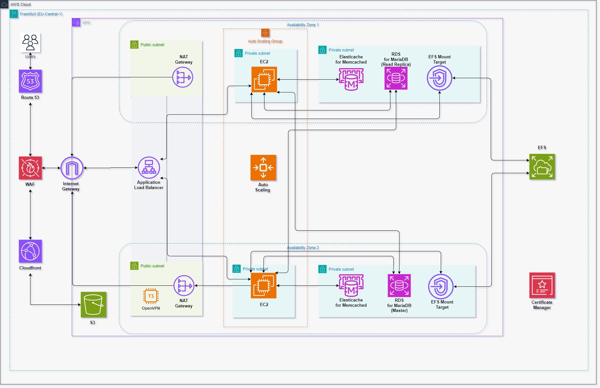

# ec2case

## Case

1. hosting101.com high trafic website
2. Variable traffic load, max 10k traffic 
3. SEO score is very important, it should load very quickly
4. Website is under attack from different countries and ip adresses
5. It needs daily backup

### Stack
1. Wordpress, PHP 8.1
2. Database, MariaDB
3. Site size 30gb
4. Memcached

### Demands
1. Draw architecture diagram with draw.io
2. Calculate cost of system with AWS Pricing Calculator
3. Give detail about network. Create VPS, determine CIDR blocks and show subnets
4. Prepare Proof of Concept Phase 1 according to flow.

---

## Architecture

### Chosen Region

#### Latency

[According to this site](https://www.cloudping.info/)

    Lowest latency regions: Milan, Zurich, Frankfurt

#### Cost

According to this work https://www.concurrencylabs.com/blog/choose-your-aws-region-wisely/

    Cheapest regions considering latency: Stockholm, Ireland, Frankfurt
    Cheapest region among lowest latency regions: Frankfurt

All services I'll use are available [here](https://aws.amazon.com/about-aws/global-infrastructure/regional-product-services/).

### Diagram
[interactive diagram link](https://temasictfic.github.io/ec2case/)

Example Architectures:  

https://docs.aws.amazon.com/whitepapers/latest/best-practices-wordpress/reference-architecture.html  
https://github.com/aws-samples/aws-refarch-wordpress?tab=readme-ov-file  
https://medium.com/@vcoder/highly-available-and-secured-wordpress-on-aws-a-comprehensive-guide-56cbf7808a35  
https://apg-library.amazonaws.com/content/0db96376-dadb-4545-b130-ebbe64acd4e9

Extra:  

https://github.com/awslabs/diagram-as-code

### Network Configuration Detail

#### VPC Configuration:  

| VPC CIDR Block     | Subnets                 | Usage                            |
|----------------|-------------------------|----------------------------------|
| 10.0.0.0/16    | 10.0.1.0/24, 10.0.2.0/24   | Public Subnets (NAT Gateways and OpenVPN EC2 instance) |
|                | 10.0.3.0/24, 10.0.4.0/24   | Private Subnets (EC2 instances) |
|                | 10.0.5.0/24, 10.0.6.0/24   | Private Subnets (RDS, and ElastiCache instances) |

Resource:  

https://docs.aws.amazon.com/vpc/latest/userguide/vpc-cidr-blocks.html

#### Security Groups ve Network ACLs:  

Security Groups: Separate security groups will be created for web servers, RDS, and ElastiCache.
Network ACLs: Rules will be added to block specific IPs for DDoS and other attacks.

### Cost Estimate  

https://calculator.aws/#/estimate?id=a683e2aaef679fb031519f81b21cacf8d0037c66

Resources:  

https://freedium.cfd/https://medium.com/geekculture/how-to-estimate-vcpu-core-memory-disk-size-for-a-cloud-server-31fa26c883f5  
https://nestify.io/blog/aws-wordpress-hosting-cost-in-2024/  
https://medium.com/aws-activate-startup-blog/scaling-on-aws-part-1-a-primer-dbf1276ded5a#.fqkp7yg1k  
https://medium.com/aws-activate-startup-blog/scaling-on-aws-part-2-10k-users-8ad391a56de6#.2em51ojaa  
https://medium.com/aws-activate-startup-blog/scaling-on-aws-part-3-500k-users-3750b227b761#.cdpgobkxz  
https://medium.com/aws-activate-startup-blog/scaling-on-aws-part-4-one-million-users-82ae773a55cc#.eu20777sa  

https://techinsidertalk.com/aws-wordpress-hosting-cost/  
https://pagespeed.website/blog/how-much-does-wordpress-hosting-on-aws-really-cost  
https://docs.aws.amazon.com/whitepapers/latest/how-aws-pricing-works/amazon-ec2-cost-breakdown.html  
https://docs.aws.amazon.com/pricing-calculator/latest/userguide/ec2-estimates.html
https://aws.amazon.com/calculator/calculator-assumptions/

Extras:  

https://www.densify.com/resources/ec2-instance-types/
https://aws.amazon.com/blogs/architecture/overview-of-data-transfer-costs-for-common-architectures

### Notes for Chosen Services

#### Route 53  

AWS Route 53 is a scalable and highly available domain name system (DNS) web service provided by Amazon Web Services (AWS).
It is used to route internet traffic to the appropriate resources, such as web servers or load balancers, based on the domain name requested by the user.
Route 53 provides various features like domain registration, DNS management, health checks, and traffic routing policies.

Resources: 
    
https://github.com/open-guides/og-aws?tab=readme-ov-file#route-53
https://docs.aws.amazon.com/Route53/latest/DeveloperGuide/routing-policy.html#routing-policy-latency

---
#### WAF

WAF (Web Application Firewall) is used in conjunction with the CloudFront and ALB services to inspect and block  allow web requests based on user-configurable conditions.
HTTPS and HTTP requests are supported with this service.
WAF's strength is in detecting malicious activity based on pattern-matching inputs for attacks such as SQL injections, XSS, etc.
WAF supports inspection of requests received through both IPv6 and IPv4.

Resources:  
https://github.com/open-guides/og-aws?tab=readme-ov-file#waf

---

#### Shield Standard

AWS Shield Standard is a managed Distributed Denial of Service (DDoS) protection service provided by Amazon Web Services (AWS).
It helps protect applications running on AWS from common and most frequently observed DDoS attacks.
Shield Standard is automatically enabled for all AWS customers at no additional cost.

Resources:  
https://docs.aws.amazon.com/waf/latest/developerguide/ddos-standard-summary.html

---

#### CloudFront
CloudFront is AWS’ content delivery network (CDN).
Its primary use is improving latency for end users through accessing cacheable content by hosting it at over 60 global edge locations.

For good web performance, it is recommended to enable compression on CloudFront distributions if the origin is S3 or another source that does not already compress.

Resources:  
https://github.com/open-guides/og-aws?tab=readme-ov-file#cloudfront

---

#### Certificate Manager

AWS Certificate Manager (ACM) is a service that lets you easily provision, manage, and deploy SSL/TLS certificates for use with AWS services and your internal connected resources. It provides a simple and automated way to create, validate, renew, and deploy certificates. ACM takes care of the complexity associated with certificate management, such as certificate provisioning, renewal, and deployment, allowing you to focus on your applications.

Create a certificate using ACM.
Validate the ownership of the domain(s) associated with the certificate.
Use the certificate with AWS services like Elastic Load Balancer (ELB), CloudFront, API Gateway, etc.
ACM automatically handles the renewal and deployment of the certificate, ensuring your applications are always secured.

Resource:  
https://github.com/open-guides/og-aws?tab=readme-ov-file#certificate-manager
https://docs.aws.amazon.com/acm/latest/userguide/what-is-acm.html

---

#### Internet Gateway

An Internet Gateway is a horizontally scalable, redundant, and highly available AWS service that allows communication between instances in your VPC and the internet. It acts as a gateway between your VPC and the internet, enabling internet access for resources within your VPC.

Key features of the Internet Gateway include:

1. **Connectivity**: It provides a connection point to the internet for your VPC, allowing instances to access the internet and be accessed from the internet.
2. **Traffic Control**: It allows you to control inbound and outbound traffic to and from your VPC using security groups, network ACLs, and routing tables.
3. **High Availability**: It is designed to be highly available and automatically scales to handle large amounts of traffic.
4. **Security**: It provides protection against common network-based attacks, such as DDoS attacks, by leveraging AWS Shield and other security features.

Resource:  
https://docs.aws.amazon.com/vpc/latest/userguide/VPC_Internet_Gateway.html

---

#### Application Load Balancer

The AWS Application Load Balancer (ALB) is a load balancing service provided by Amazon Web Services (AWS). It distributes incoming application traffic across multiple targets, such as Amazon EC2 instances, containers, and IP addresses, in multiple Availability Zones. ALB operates at the application layer (Layer 7) of the OSI model and supports advanced features like content-based routing, SSL/TLS termination, and path-based routing.

- ALB can be used to improve the availability and fault tolerance of your applications by distributing traffic across multiple targets.
- It can be used to scale your applications horizontally by adding or removing targets dynamically based on the traffic load.
- ALB supports various routing methods, allowing you to route traffic based on the content of the request, the path of the URL, or other criteria.
- ALB is a regional service, meaning it is scoped to a specific AWS region.

Resource:  
https://github.com/open-guides/og-aws?tab=readme-ov-file#alb
https://docs.aws.amazon.com/elasticloadbalancing/latest/application/introduction.html

---

#### Nat Gateway

A NAT Gateway is a managed network address translation (NAT) service provided by Amazon Web Services (AWS). It allows instances within a private subnet to connect to the internet while keeping them isolated from inbound connections. 

Key features of the NAT Gateway include:

1. **Outbound Internet Access**: It enables instances in private subnets to access the internet for software updates, patching, and other external dependencies.
2. **Secure Communication**: It provides an additional layer of security by hiding the private subnet's IP addresses from the internet.
3. **Highly Available**: It is designed to be highly available and automatically scales to handle increased traffic.

Resource:  
https://docs.aws.amazon.com/vpc/latest/userguide/vpc-nat-gateway.html
https://github.com/open-guides/og-aws?tab=readme-ov-file#vpc-and-network-security-gotchas-and-limitations

---

#### OpenVPN

Using a VPN can provide better visibility and control over connections and connection attempts. It also reduces the attack surface compared to exposing services over the public internet. A common pattern is to use a bastion host behind a VPN for SSH connections. For a cost-effective VPN solution to access private AWS resources, consider using OpenVPN. It can be installed using the official AMI or the openvpn package on Linux, with the latter allowing for unlimited concurrent users. An OpenVPN installer script can assist with installation and adding client keys.

Resource:  
https://github.com/open-guides/og-aws?tab=readme-ov-file#vpc-and-network-security-tips
https://docs.aws.amazon.com/vpc/latest/userguide/vpn-connections.html
https://cloudonaut.io/your-single-aws-account-is-a-serious-risk/

---

#### Auto Scaling

Auto Scaling Groups (ASGs) are used to control the number of instances in a service, reducing manual effort to provision or deprovision EC2 instances.
They can be configured through Scaling Policies to automatically increase or decrease instance counts based on metrics like CPU utilization, or based on a schedule.
There are three common ways of using ASGs - dynamic (automatically adjust instance count based on metrics for things like CPU utilization), static (maintain a specific instance count at all times), scheduled (maintain different instance counts at different times of day or on days of the week).
💸ASGs have no additional charge themselves; you pay for underlying EC2 and CloudWatch services.

Resource:  
https://github.com/open-guides/og-aws?tab=readme-ov-file#auto-scaling-basics

---

#### EC2

The AWS Elastic Compute Cloud (EC2) service provides scalable computing capacity in the cloud. It allows you to
create and manage virtual machines, known as instances, and run applications on them. EC2 instances can be
easily scaled up or down based on your needs, providing flexibility and cost efficiency.    
This module provides functions to interact with the EC2 service, such as creating instances, managing security
groups, and configuring networking. It also includes utilities for monitoring and managing EC2 resources.   
For more information about the AWS EC2 service, refer to the official documentation:

Resource:  
https://github.com/open-guides/og-aws?tab=readme-ov-file#ec2
https://docs.aws.amazon.com/ec2/

---

#### Elasticache for Memcached

ElastiCache is a managed in-memory cache service, that can be used to store temporary data in a fast in-memory cache, typically in order to avoid repeating the same computation multiple times when it could be reused.
It supports both the Memcached and Redis open source in-memory cache software and exposes them both using their native access APIs.
The main benefit is that AWS takes care of running, patching and optimizing the cache nodes for you, so you just need to launch a cluster and configure its endpoint in your application, while AWS will take of most of the operational work of running the cache nodes.

Resource:  
https://github.com/open-guides/og-aws?tab=readme-ov-file#elasticache

------------------------------------------------------------------------------------------------------

#### RDS for MariaDB

RDS is a managed relational database service, allowing you to deploy and scale databases more easily. It supports Oracle, Microsoft SQL Server, PostgreSQL, MySQL, MariaDB, and Amazon’s own Aurora.
RDS offers out of the box support for high availability and failover for your databases.

Resource:  
https://github.com/open-guides/og-aws?tab=readme-ov-file#rds
https://github.com/open-guides/og-aws?tab=readme-ov-file#rds-mysql-and-mariadb
https://docs.aws.amazon.com/AmazonRDS/latest/UserGuide/Concepts.MultiAZSingleStandby.html
https://docs.aws.amazon.com/AmazonRDS/latest/UserGuide/USER_ReadRepl.html
https://aws.amazon.com/rds/features/multi-az/?nc1=h_ls
https://community.aws/content/2dj5ViJTpDlQZYmsplIwGarLcyj/
improving-availability-and-performance-with-multi-az-architecture

    
Amazon RDS Multi-AZ Deployments:  

In a Multi-AZ deployment, Amazon RDS automatically creates a primary database (DB) instance and synchronously replicates the data to a standby instance in a different Availability Zone1.
The primary purpose of Multi-AZ deployments is to provide high availability and failover support for DB instances2.
If the primary DB instance becomes unavailable due to a failure, Amazon RDS automatically fails over to the standby instance without manual intervention1.
The standby instance is not used to serve read traffic and is not directly accessible2.
Multi-AZ deployments can be more expensive because they maintain a synchronous standby replica in a different Availability Zone1. This effectively doubles the cost of the instance due to the hot standby capacity it provides.

Read Replicas:  

A Read Replica, on the other hand, is a read-only copy of the database3.
Read Replicas are primarily used to offload read traffic from the primary DB instance4.
Unlike the standby instance in a Multi-AZ deployment, Read Replicas serve traffic and are directly accessible5.
In summary, while both Multi-AZ deployments and Read Replicas provide redundancy, they serve different purposes. Multi-AZ deployments are used for high availability and automatic failover, while Read Replicas are used to scale read operations and offload traffic from the primary DB instance

Read Replicas are billed as standard DB instances at the same rates.
You are not charged for the data transfer incurred in replicating data between your source DB instance and Read Replica within the same AWS Region2. However, there would be data transfer charges for cross-region replication.

---

#### EFS

🐥EFS is Amazon’s network filesystem. It’s presented as an NFSv4.1 server. Any compatible NFSv4 client can mount it.
It is designed to be highly available and durable and each EFS file system object is redundantly stored across multiple availability zones.
EFS is designed to be used as a shared network drive and it can automatically scale up to petabytes of stored data and thousands of instances attached to it.
EFS can offer higher throughput (multiple gigabytes per second) and better durability and availability than EBS (see the comparison table), but with higher latency.
EFS is priced based on the volume of data stored, and costs much more than EBS; it's in the ballpark of three times as much compared to general purpose gp2 EBS volumes.

Resource:  
https://github.com/open-guides/og-aws?tab=readme-ov-file#efs

---

#### S3

The AWS Simple Storage Service (S3) is a scalable object storage service that allows you to store and retrieve
large amounts of data. It provides durability, availability, and security for your data. With S3, you can store
and retrieve any amount of data from anywhere on the web.

Resource:  
https://github.com/open-guides/og-aws?tab=readme-ov-file#s3
https://docs.aws.amazon.com/s3/index.html
https://github.com/open-guides/og-aws?tab=readme-ov-file#storage-durability-availability-and-price

### Additional Links  

https://github.com/fatihes1/AWS-ile-Bulut-Bilisimin-Temelleri?tab=readme-ov-file
https://github.com/mikeroyal/AWS-Guide
https://wblinks.com/notes/aws-tips-i-wish-id-known-before-i-started/
https://expeditedsecurity.com/aws-in-plain-english/
https://instances.vantage.sh/
